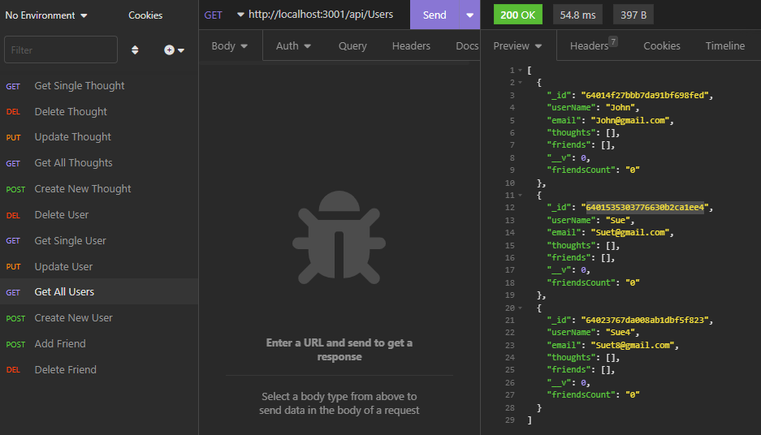

# socialnetworkapi

 []
 
 ## Description:
 Social network web app where users can share their thoughts, react to friends’ thoughts, and create a friend list.  Utilizing Express.js for routing, MongoDB for  database, and Mongoose ODM. 

## Contents
  
  
  2. [Installation](#installation)
  
  3. [Usage](#usage)
  
  4. [Contributing](#contributing)
  
  5. [Tests](#tests)
  
  
## Installation:
  
  clone the repository
  
  ---
  
## Usage:
 
 To utilize the social network API app, go to VScode and run "node index.js" in your command line. Then open Insomnia and send the API CRUD routes.
 
  ---
 
  ## License
  
  License used for this project - MIT
  [![License: MIT]](https://opensource.org/licenses/MIT)
  
  ---
  
  ## Contributing:
  
  Please follow these instructions to contribute to the project:
  create pull request from seperate branch and await approval
  
  ---
  
  ## Tests:
  
  no test required. simply run the app
  
  ---
  
 ## Questions
  
  * GitHub Username: WSCoding
  * Link to Github user profile: github.com/whitspa
  * Email Address: whitspa64@duck.com

## Link to the walkthrough video demonstrating the functionality of the app
https://drive.google.com/file/d/113WjFXDYsxbMCP15zEpLe0ZWGWsbYb0i/view
  
 
  A screen shot of the application is below:

